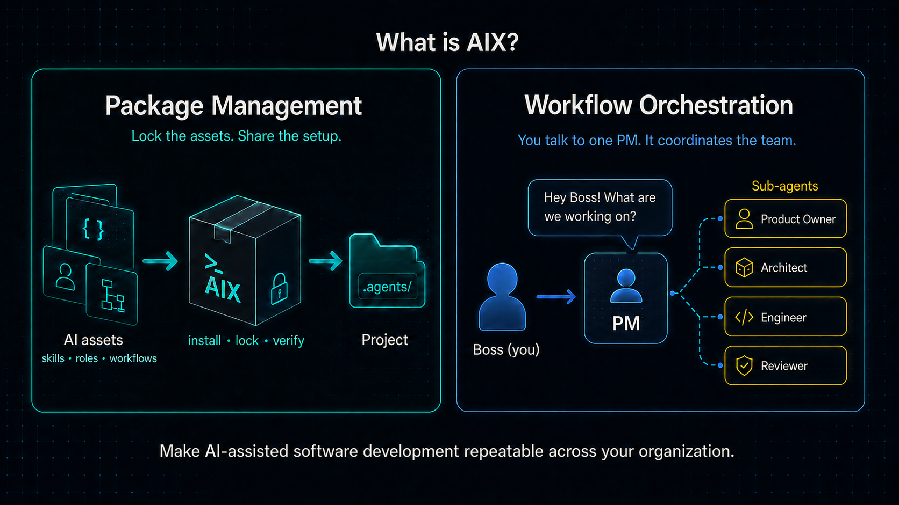

# AIX: Package management and workflow orchestration for AI-assisted software development

[](https://github.com/tekfoundry/ai-extensions/actions/workflows/ci.yml)
[](https://github.com/tekfoundry/ai-extensions/releases)




## What is AIX?

AIX helps teams manage and use AI-agent behavior inside their software
projects.

### Package management

AIX is a package manager for AI-related assets. It installs, locks, updates,
diffs, verifies, and safely removes skills, roles, workflows, guidance, and
templates from project-local sources.

Agent behavior lives with the project, travels in version control, and stops
before local edits are overwritten. See [package management](docs/package-management.md)
for the asset model, lockfiles, sources, activation, and drift protection.

### Workflow orchestration

AIX is an opinionated workflow orchestration tool for AI-assisted software
development. A workflow can register a team with the project manager. Boss, you - 
the human decision principal, gives the PM the request. The PM delegates
bounded work to team members as sub-agents and brings the results back together.

The bundled `design-plan-execute` workflow uses this model for planning,
implementation, verification, and documentation. See [workflow orchestration](docs/workflow-orchestration.md)
for the PM model and workflow lifecycle.

## Try it in 60 seconds

```bash
npm install -g @tekfoundry/aix
cd your-project
aix init
aix workflow install
aix status
aix verify
```

`aix init` initializes package-management state. `aix workflow install` adds
the bundled default workflow and its PM team.

## Why use AIX?

- Give projects a shared, reviewable set of agent assets.
- Pin agent behavior to resolved Git versions.
- Review workflow and skill changes before accepting them.
- Detect local edits before package-managed files are changed or removed.
- Give agents a defined process for planning, delegation, implementation,
  verification, and documentation.

## Learn more

- [Getting started](docs/getting-started.md)
- [Package management](docs/package-management.md)
- [Workflow orchestration](docs/workflow-orchestration.md)
- [Command reference](docs/command-reference.md)
- [Design-plan-execute workflow](aix/workflows/design-plan-execute/README.md)
- [Agile Kanban workflow](aix/workflows/agile-kanban/README.md)

The command is `aix`. The npm package is `@tekfoundry/aix`.

See the project promotion page at [tekfoundry.com/aix](https://tekfoundry.com/aix).
