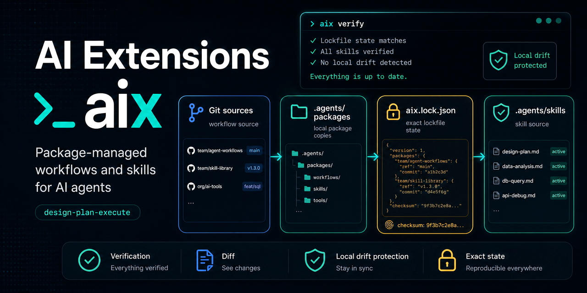
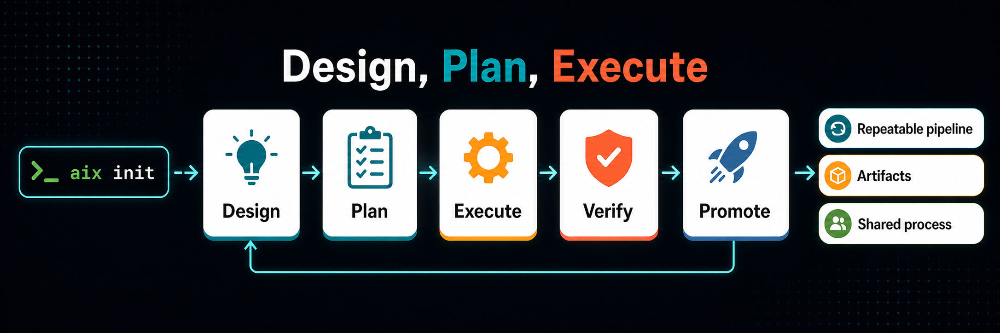
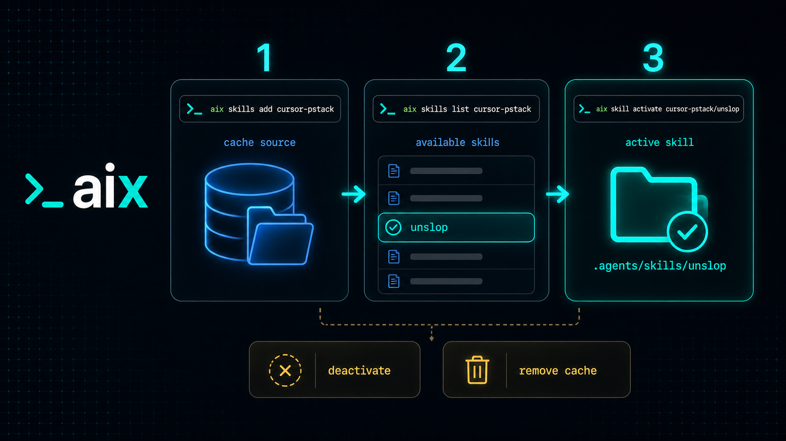

# AI Extensions (AIX): A package-manager-style CLI for AI-agent workflows and skills



AIX helps developers install, lock, diff, update, and share project-local AI-agent 
workflows with the same discipline they already use for code dependencies.

It exists because agent instructions are starting to matter as much as scripts,
tests, and config. A useful review skill, planning workflow, or repo bootstrap
process should not live as a pasted note in one project and a slightly stale
copy in five others. `aix` gives those assets a normal developer lifecycle:
install them from Git, keep them local to the project, lock the exact version,
review updates, and refuse to overwrite local edits silently.

The first assets are workflows and skills.

- A workflow is the project's AI operating model. It installs process docs under
  `.agents/`, can add a workflow-owned block in `AGENTS.md`, and activates the
  skills that help agents follow the process.
- A skill is one reusable agent capability. It is activated into
  `.agents/skills/<name>` so compatible agents can discover and use it.

The command is `aix`. The npm package is `@tekfoundry/aix`.

See the project promotion page at [tekfoundry.com/aix](https://tekfoundry.com/aix).

## Try it in 60 seconds

```bash
npm install -g https://github.com/tekfoundry/ai-extensions/releases/download/v0.0.0/tekfoundry-aix-0.0.0.tgz
aix init
aix status
aix verify
```

## Why use it

Use `aix` when you want AI-agent behavior to be shared, reviewable, and tied to
the project where it runs.

Common cases:

- Give every repo the same planning and verification workflow without copying
  `.agents` files by hand.
- Keep code review, testing, migration, or release skills in one Git repo and
  activate only the ones a project needs.
- Pin agent behavior to a commit so a project does not change because an
  upstream prompt changed overnight.
- Review workflow and skill changes with `aix workflow diff` and
  `aix skills diff` before accepting them.
- Detect local edits before an update or uninstall removes someone else's work.
- Use aliases when two sources publish skills with the same front matter name.
- Start with Git. No registry, service account, or global agent install is
  required for the MVP.

## Who should use this?

- Solo developers using coding agents across multiple repos
- Teams standardizing AI-agent behavior
- Organizations that want AI-agent behavior to be reviewable, pinned, auditable, and repo-local
- Maintainers publishing reusable workflows or skills

## Install

The package is prepared for scoped npm distribution. Once it is published, the
install path will be:

```bash
npm install -g @tekfoundry/aix
```

> [!WARNING]
> **Temporary install path:** The `@tekfoundry/aix` npm package is not published yet. 
> Until scoped npm publishing is complete, install the packed build from the GitHub Release artifact:
>
> ```bash
> npm install -g https://github.com/tekfoundry/ai-extensions/releases/download/v0.0.0/tekfoundry-aix-0.0.0.tgz
> ```

A quick verification test after installation:

```bash
aix --help
```

Advanced users who want to build and test directly from this repository:

```bash
npm install
npm run build
node bin/aix.js --help
```

To create the release artifact locally:

```bash
npm run release:github-artifact
```

## Quick start

Initialize a project:

```bash
aix init
```

`aix init` installs the bundled `design-plan-execute` workflow, writes
`aix.json` and `aix.lock.json`, installs workflow docs into `.agents/`, inserts
the managed workflow block into `AGENTS.md`, and activates workflow-owned skills
under `.agents/skills`. It also activates the standalone
`code-review-refactor` skill from the default `aix` skill source.

Check the installed state:

```bash
aix status
aix verify
```

Add a skill source and activate a skill:

```bash
aix skills add https://github.com/mattpocock/skills/tree/main/skills mattpocock
aix skills list mattpocock
aix skill activate mattpocock/engineering/typescript
```

Review and accept updates:

```bash
aix workflow diff
aix workflow update
aix skills diff
aix skills update
```

## Workflows

[](aix/workflows/design-plan-execute/README.md)

A workflow is installed as one package because it defines how a project wants
agents to work. You can [create your own custom workflows](#custom-workflow),
or start with one of the default `aix` workflows.

Default `aix` workflows:

`design-plan-execute` is the default planning and execution workflow for coding
agents. It gives agents a repeatable loop for reading design intent, creating
or activating plans, implementing small tasks, verifying changes, and promoting
durable decisions back into docs.

Install it directly:

```bash
aix workflow install https://github.com/tekfoundry/ai-extensions/tree/master/aix/workflows/design-plan-execute aix
```

It includes:

- `.agents/README.md`, the process router
- `.agents/workflow.md`, the agent lifecycle and planning contract
- `.agents/engineering-best-practices.md`, reusable engineering guidance
- workflow-owned skills for project setup, plan lifecycle work, implementation,
  verification, and design promotion
- a managed block in root `AGENTS.md` that tells agents where to start
- expected project documentation directories under `_docs/`

The default init profile also activates `code-review-refactor` as a normal
standalone skill from `aix/skills`. It is not owned by the workflow lifecycle.

See [the workflow details](aix/workflows/design-plan-execute/README.md) for the
full file list, skill list, and installed layout.

### Custom workflow

A custom workflow is a Git-backed directory with a `workflow.json` file:

```text
workflows/team-flow/
  workflow.json
  AGENTS.append.md
  README.md
  workflow.md
  engineering-best-practices.md
  skills/
    project-init/
      SKILL.md
    task-execute/
      SKILL.md
```

For a complete example, see the bundled
[`design-plan-execute` workflow directory](aix/workflows/design-plan-execute/).

Example `workflow.json`:

```json
{
  "name": "team-flow",
  "title": "Team Flow",
  "agentsMd": {
    "mode": "managed-block",
    "source": "AGENTS.append.md",
    "marker": "aix:workflow team-flow"
  },
  "docs": [
    "README.md",
    "workflow.md",
    "engineering-best-practices.md"
  ],
  "skillsDir": "skills"
}
```

Rules to keep in mind:

- `name` must match the workflow folder name.
- `docs` are copied into `.agents/`.
- `AGENTS.append.md` is inserted into root `AGENTS.md` inside a managed block.
- Skills under `skills/<name>/SKILL.md` are activated as workflow-owned skills.
- Workflow-owned skills cannot be removed with `aix skill deactivate`; uninstall
  or update the workflow instead.

Install it from a GitHub tree URL:

```bash
aix workflow install https://github.com/example/ai-assets/tree/main/workflows/team-flow team-flow
```

### Workflow commands

Install a workflow:

```bash
aix workflow install
aix workflow install https://github.com/example/ai-assets/tree/main/workflows/team-flow team-flow
```

With no URL, `aix` shows bundled workflows. With a URL, it installs the
Git-backed workflow directly. Only one workflow can be active at a time in the
MVP.

Update or inspect the active workflow:

```bash
aix workflow diff
aix workflow update
aix workflow uninstall
```

`aix workflow diff` compares the locked workflow package with the currently
resolved source. `aix workflow update` refreshes the installed docs, managed
`AGENTS.md` block, workflow-owned skills, and lockfile after drift checks pass.
`aix workflow uninstall` removes only package-managed workflow content. It
leaves project-owned `_docs` content and any `AGENTS.md` text outside the
managed block alone.

## Skills



Skills are already showing up as shared Git repositories. A few useful examples
to browse:

- [anthropics/skills](https://github.com/anthropics/skills), a public Agent
  Skills repo with examples, templates, and document-oriented skills.
- [mattpocock/skills](https://github.com/mattpocock/skills), engineering skills
  for planning, diagnosis, architecture, and testing workflows.
- [cursor/plugins](https://github.com/cursor/plugins/tree/main/pstack/skills),
  the source for Cursor's pstack skills.

Those repositories are useful, but copying files from them by hand gets messy.
`aix` turns a skill repo into a reusable project source. You add the source
once, list the skills it exposes, then activate only the skills your project
needs.

A skill is a folder with a `SKILL.md` file. `aix` keeps source collections,
project package copies, and active skill names separate:

- `aix skills add` declares and indexes a Git source.
- `aix skills list` shows discoverable skills from that source.
- `aix skill activate` materializes one selected skill into the project.
- `aix skill deactivate` removes a user-activated root skill after drift checks.

That source to list to activate flow keeps `.agents/packages/skills` organized
by upstream source, exposes only active skills through `.agents/skills`, and
lets you choose an alias when two skills want the same active name.

For teams, the real payoff is that `aix.json` and `aix.lock.json` can travel
with the repo. Every developer environment can activate the same skill set from
the same sources at the same locked commits, instead of each person maintaining
their own private pile of agent instructions.

Add a source:

```bash
aix skills add https://github.com/example/skills/tree/main/skills team-skills
```

List skills from that source:

```bash
aix skills list team-skills
```

Activate one skill:

```bash
aix skill activate team-skills/review
```

Activate with an alias:

```bash
aix skill activate team-skills/review team-review
```

The aliased form uses `team-review` as the active local name without changing
the upstream package copy.

Update, diff, deactivate, and remove:

```bash
aix skills diff
aix skills update
aix skill deactivate team-review
aix skills remove team-skills
```

`aix skills remove` only removes a source after all active skills from that
source have been deactivated.

### Custom skill

Create a skill folder in a Git repo:

```text
skills/
  review/
    SKILL.md
```

Example `SKILL.md`:

```md
---
name: review
description: Review code changes for correctness, regression risk, and missing tests.
---

# Review

Use this skill when the user asks for a code review.

Start with findings, ordered by severity. Include file and line references.
Then list open questions, test gaps, and residual risk. Keep summaries brief.
```

Then add the repo and activate the skill:

```bash
aix skills add https://github.com/example/ai-assets/tree/main/skills team-skills
aix skill activate team-skills/review
```

Skill folders can be flat or nested. `aix skills list <source>` reports folders
that contain `SKILL.md` by their source-relative path.

## Shared configuration


`aix` makes agent configuration shareable in the same way application
dependencies are shareable: commit the manifest and lockfile, and every project
checkout knows which workflow, skill sources, and active skills the team uses.

`aix.json` is the shared intent. It declares the sources a project trusts, the
workflow it runs, and the root skills the team wants active:

```json
{
  "sources": {
    "workflows": {
      "aix": "https://github.com/tekfoundry/ai-extensions/tree/master/aix/workflows/design-plan-execute"
    },
    "skills": {
      "mattpocock": "https://github.com/mattpocock/skills/tree/main/skills",
      "private-skills": {
        "type": "git",
        "url": "git@github.com:example/private-skills.git",
        "path": "skills",
        "ref": "main"
      }
    }
  },
  "workflow": "aix:aix/workflows/design-plan-execute",
  "skills": [
    "mattpocock:engineering/typescript",
    {
      "source": "private-skills",
      "path": "review",
      "alias": "team-review"
    }
  ]
}
```

`aix.lock.json` is the exact installed state. It records resolved Git commits,
package paths, activation paths, active names, aliases, workflow docs, managed
`AGENTS.md` block hashes, and file hashes.

Together, those files let an organization publish reusable agent assets once
and activate them consistently across many repos. One team can keep review,
testing, migration, or release skills in a central Git source; each project can
opt into the subset it needs; and every teammate gets the same locked agent
behavior after syncing the repo.

That split also keeps updates reviewable. `aix skills diff` and
`aix workflow diff` show what would change before the lockfile moves forward.
`aix verify`, `aix status`, update, diff, deactivate, and uninstall commands use
the lockfile to decide what is still managed by `aix` and to stop before
overwriting local edits.

## Familiar command patterns


The UX is intentionally close to package managers developers already know, like
`npm`, Composer, Bundler, or Cargo. You add sources, activate packages, review
diffs, update locked versions, verify the installed state, and uninstall managed
assets with explicit commands.

That keeps the tool approachable even though the files it manages are new.
Teams do not need to learn a new mental model for sharing agent behavior. The
same habits they already use for project dependencies apply here: declare what
the project wants, lock what was installed, review changes before accepting
them, and stop when local edits would be overwritten.

```bash
aix init
aix status
aix verify
aix workflow install [git-or-github-tree-url] [alias]
aix workflow uninstall
aix workflow update
aix workflow diff
aix skills add <git-or-github-tree-url> [alias]
aix skills remove <source-name>
aix skills list [source]
aix skills update [source/path]
aix skills diff [source/path]
aix skill activate [source/path] [alias]
aix skill deactivate <active-name>
```

Interactive forms are available for `workflow install`, `skills list`,
`skills remove`, `skill activate`, and `skill deactivate` when the target is
not provided.

## Project docs

The `aix` project was developed using the `design-plan-execute` workflow. As a
result, this repo includes the artifacts generated by that process. They are
useful both as project history and as a concrete example of how the workflow
organizes agent-assisted development:

- `_docs/design/` stores accepted design intent.
- `_docs/plans/` stores active implementation plans.
- `_docs/plans/backlog/` stores plans that are written but not active yet.
- `_docs/plans/completed/` stores completed plan records.

Current design docs:

- [_docs/design/README.md](_docs/design/README.md)
- [_docs/design/overview.md](_docs/design/overview.md)
- [_docs/design/cli.md](_docs/design/cli.md)
- [_docs/design/package-management.md](_docs/design/package-management.md)
- [_docs/design/workflows.md](_docs/design/workflows.md)
- [_docs/design/bundled-skills.md](_docs/design/bundled-skills.md)

Current plans:

- [_docs/plans/mvp-release.md](_docs/plans/mvp-release.md)
