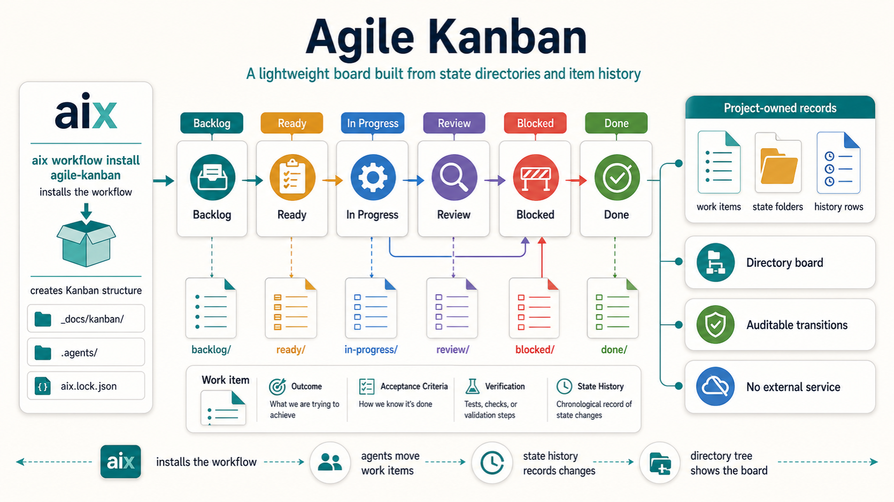

# Agile Kanban



`agile-kanban` is an `aix` workflow for software projects that want a lightweight
Kanban loop without depending on Jira, Trello, GitHub Projects, Linear, or any
other external service.

The workflow keeps work visible in project-owned Markdown files while keeping
the reusable agent process under `.agents/`. It is intended for developers who
want agents to help create, prioritize, execute, review, and complete small
work items in an existing codebase.

## Installed Shape

After installation, the workflow provides:

- `.agents/README.md`: this workflow overview.
- `.agents/workflow.md`: the Kanban process contract and work item lifecycle.
- `.agents/engineering-best-practices.md`: implementation and review guidance.
- `.agents/skills/kanban-create-item`: create a backlog work item.
- `.agents/skills/kanban-prioritize`: order and move backlog items to ready.
- `.agents/skills/kanban-execute`: implement one ready or in-progress item.
- `.agents/skills/kanban-review`: review one item before completion.
- `.agents/skills/kanban-complete`: close one reviewed item.
- a workflow template for work item documents.

The workflow expects project-owned Kanban files under `_docs/kanban/`:

```text
_docs/
  kanban/
    backlog/
      <work-item>.md
    ready/
    in-progress/
    review/
    blocked/
    done/
```

Existing project files remain project-owned. Installing or updating the
workflow should not rewrite work item history.

## Kanban States

Use these states consistently:

- `Backlog`: captured work that is not ready to start.
- `Ready`: small, clear, and unblocked work available to pull.
- `In Progress`: work currently being implemented.
- `Review`: implementation is complete enough for review and verification.
- `Blocked`: work cannot continue without a decision, dependency, or fix.
- `Done`: accepted, verified, documented where needed, and closed.

Prefer explicit movement over hidden assumptions. A work item should explain why
it moved states, what verification exists, and what risks remain.

## Typical Prompts

```text
Use kanban-create-item for this bug: ...
Use kanban-prioritize to select the next ready item.
Use kanban-execute on KAN-003.
Use kanban-review on the current item.
Use kanban-complete for KAN-003.
```

## Board Source

The board is the directory tree under `_docs/kanban/`. Work items move between
state directories as their status changes. Generate a board summary by listing
the item files in each state directory; do not maintain a separate board file as
source of truth.

## Templates

The workflow includes `templates/work-item.md` for a single work item record.

Projects may publish and customize templates with normal AIX template commands
after the workflow is installed.
