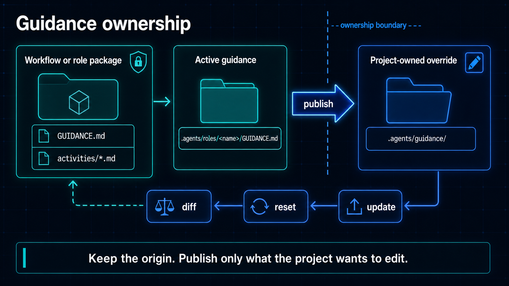

# Author guidance for AIX



Guidance is reusable judgment that agents can read while they follow a role,
skill, or workflow activity. It is separate from the role contract, the skill
procedure, the workflow process, and project knowledge.

Use guidance to explain how to make decisions in a recurring situation. Keep
the role or skill responsible for defining what the agent does, and keep
guidance responsible for the judgment it should apply while doing it.

## Two kinds of guidance

### Role guidance

Role guidance travels with a role bundle in `GUIDANCE.md`:

```text
roles/
  quality-engineer/
    ROLE.md
    GUIDANCE.md
```

It gives the role-specific perspective, working rules, risk judgment, and
output discipline that apply whenever the role is delegated. Bundled AIX and
workflow-owned roles include `GUIDANCE.md`; external standalone role packages
may omit it.

Role guidance can declare related workflow guidance with `uses_guidance`:

```md
---
uses_guidance:
  - activities/verification
  - activities/review
---

# Quality engineer guidance

Decide what evidence is needed before a change can be trusted. Map checks to
implementation risk and report failed checks, gaps, and residual risk.
```

Active role guidance lives beside the active role at
`.agents/roles/<name>/GUIDANCE.md`. It is project-editable after activation.

### Workflow activity guidance

Workflow guidance belongs to the process the workflow defines. A package can
organize it like this:

```text
guidance/
  README.md
  shared.md
  activities/
    planning.md
    implementation.md
    review.md
    verification.md
```

Use `shared.md` for rules that apply across activities. Use files under
`activities/` for judgment specific to planning, implementation, review,
verification, or documentation. Workflow guidance can use `applies_to` metadata
to describe the roles and activities it supports.

Workflow guidance remains in its package origin after installation. It is not
copied into `.agents/guidance/` until the project explicitly publishes an
editable override.

## Companion guidance

Role bundles may also contain role-adjacent files whose names end in
`.GUIDANCE.md`. Use these for a focused piece of guidance that should be loaded
alongside a role without merging it into the role's main `GUIDANCE.md`.

Companion guidance is useful for routing or lifecycle-specific instructions.
Keep its scope clear and do not treat every companion file as universal
project guidance. The active PM, for example, can use a companion guidance file
for its workflow-specific routing behavior.

## Guidance ownership and overrides

The guidance lifecycle has separate origins and project-owned copies:

```text
workflow or role package origin
              ↓ inspect
active role guidance or workflow origin
              ↓ publish workflow overrides
project-owned .agents/guidance/
```

Publishing workflow guidance creates editable files under
`.agents/guidance/`. Role guidance is already editable in the active role
bundle, so publishing reports it rather than copying it again.

The origin remains the reference for comparison. A project can review its
customization, reset an override, and then receive future workflow updates
without losing track of where the guidance came from.

## Inspect and manage guidance

```bash
aix guidance list
aix guidance publish
aix guidance diff
aix guidance diff shared
aix guidance diff activities/verification
aix guidance diff roles/quality-engineer
aix guidance reset shared
aix guidance reset activities/verification
aix guidance reset roles/quality-engineer
aix guidance reset --all
```

`aix guidance list` shows command-ready names, kind, origin, status, and
metadata. `aix guidance publish` exposes the complete active workflow guidance
set for project editing. `aix guidance diff` compares an override with its
origin. `aix guidance reset` removes a selected override or restores active role
guidance. The `--all` form previews the complete reset before it removes
workflow overrides or restores role guidance.

AIX checks for local drift before resetting guidance and refuses to silently
replace edits. Workflow updates also keep package origins and project overrides
separate.

## Resolve guidance for a task

The optional `get-guidance` skill is a read-only resolver. Given a role, skill,
activity, and task context, it returns a small reading list from relevant role
guidance, workflow guidance, shared guidance, and legacy fallback sources. It
does not install, publish, reset, edit, or route guidance, and it does not
replace PM startup routing.

Use it when a delegated role needs help choosing the relevant guidance files:

```text
Use get-guidance for quality-engineer, plan-review, and verification.
Resolve the guidance needed for this task.
```

The bundled [`get-guidance` skill](../aix/skills/get-guidance/README.md) has the
resolver details.

## Writing useful guidance

Good guidance makes judgment explicit without repeating the role or skill. Name
the risk being managed, the context to inspect, the tradeoffs that matter, the
checks that provide evidence, and the conditions that require a handoff or
stop. Prefer concrete rules and examples over broad statements about quality.

Instruction priority still matters. User requests, project `AGENTS.md`,
workflow rules, skill procedures, role contracts, and safety boundaries outrank
guidance.
