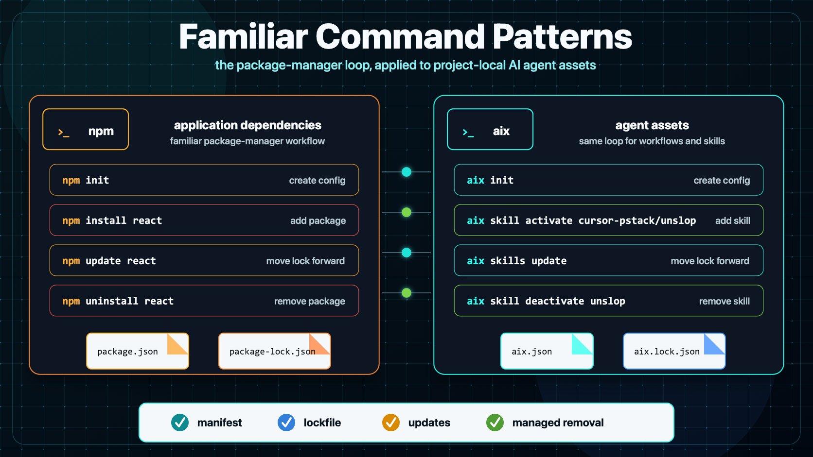
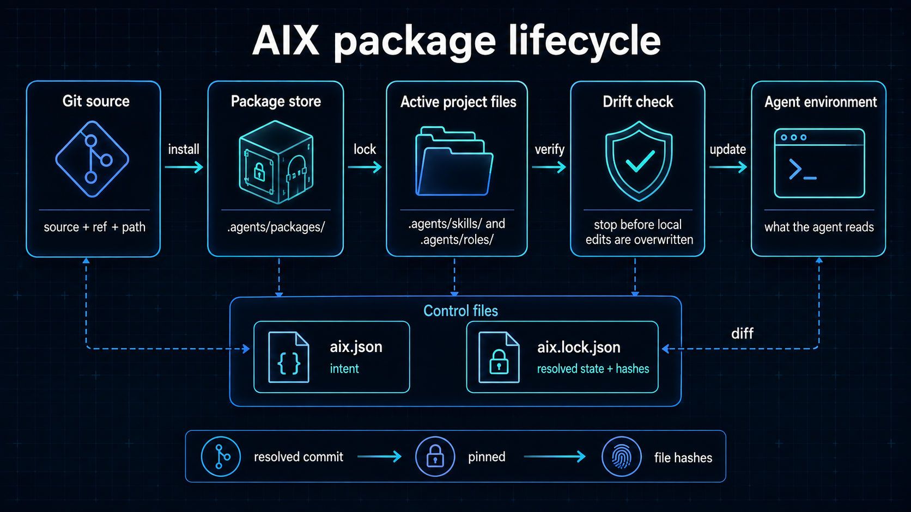
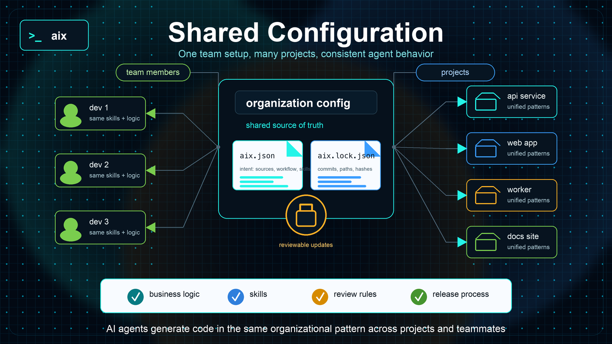

# Package management



*Manifest, lockfile, updates, and managed removal are part of the same lifecycle.*

AIX gives AI-related assets a project-local lifecycle similar to code
dependencies. Install them from Git, keep them in the project, lock the exact
version, review updates, and stop before local edits are overwritten.

Agent instructions affect how teams plan, build, and review software. A useful
skill, role, workflow, or repository bootstrap process should not live as a
pasted note in one project and a stale copy in five others. AIX packages that
behavior so teams can version, reuse, and review it.

## Asset types

AIX packages five kinds of assets. Each has a different job, but all use the
same project-local package lifecycle.

| Asset | Summary | Examples |
| --- | --- | --- |
| Skill | A repeatable procedure an agent can follow to complete a task. | `plan-create`, `task-execute`, `kanban-create-item`, `kanban-execute` |
| Role | A focused responsibility or point of view that helps an agent choose, apply, or review skills. | `aix-workflow-architect`, `technical-architect`, `quality-engineer` |
| Guidance | Reusable best-practice judgment for roles and workflow activities. | `roles/quality-engineer`, `activities/verification`, `shared` |
| Workflow | A package that coordinates skills, roles, guidance, templates, and project instructions. | `design-plan-execute`, `agile-kanban` |
| Template | A reusable structure for plans, design documents, work items, and other workflow artifacts. | `plan`, `design-doc`, `work-item` |

The same package model applies across these asset types. Skills and roles show
the pattern most directly.

## The package lifecycle



The main project files are:

- `aix.json` records project intent: configured sources, the active workflow,
  and requested standalone skills and roles.
- `aix.lock.json` records accepted resolved state: commits, package paths,
  active paths, ownership, dependency edges, aliases, and file hashes.
- `.agents/packages/` stores package-managed copies of installed skills, roles,
  and workflows.
- `.agents/skills/` and `.agents/roles/` expose active assets to the agent
  environment.

For example, a project's `aix.json` can declare its trusted sources, active
workflow, and standalone skills:

```json
{
  "sources": {
    "skills": {
      "team-skills": "https://github.com/example/skills/tree/main/skills"
    },
    "workflows": {
      "aix": "https://github.com/tekfoundry/ai-extensions/tree/master/aix/workflows/design-plan-execute"
    }
  },
  "skills": [
    "team-skills:review"
  ],
  "workflow": "aix:aix/workflows/design-plan-execute"
}
```

The matching `aix.lock.json` records the resolved commits and installed file
hashes. Commit both files with the project so another checkout can reproduce
the same agent environment.

The usual flow is:

```text
add a source → list its assets → activate selected assets
              → inspect diffs → update when ready → verify the workspace
```

For example:

```bash
aix skills add https://github.com/example/skills/tree/main/skills team-skills
aix skills list team-skills
aix skill activate team-skills/review
aix skills diff
aix skills update
aix verify
```

The command shapes are familiar if you have used a package manager before.
`aix` applies the same loop to project-local agent assets.

Use an alias when an asset's active name would collide with another asset:

```bash
aix skill activate team-skills/review team-review
```

The alias changes the active local name. It does not change the upstream
package copy.

Roles use the same source-and-activation split:

```bash
aix roles add https://github.com/example/roles/tree/main/roles team-roles
aix roles list team-roles
aix role activate team-roles/quality-engineer
```

For the full source model, including local paths, GitHub tree URLs, refs,
caching, aliases, and source removal, see [Source management](source-management.md).

## Inferred skill dependencies

A skill can declare another skill as an inferred dependency. When you activate
the parent skill, AIX resolves and activates the dependency first, then records
it as a dependency-only lockfile entry. You do not need to add each dependency
to `aix.json` yourself.

Dependency-only skills remain active while another active skill needs them. AIX
refuses to deactivate one that would leave a dependent skill without its
requirement. Deactivate the parent skill first, or update the source so the
dependency is no longer required.

## Safe updates and removal

AIX compares package and active files with the lockfile before mutating them.
If a managed file changed locally, the command stops. It does not silently
replace the edit.

This check applies to skill, role, and workflow activation, update, diff,
deactivation, and removal. It also protects workflow docs, the managed
`AGENTS.md` block, guidance origins, and template overrides.

Workflow-owned skills and roles belong to their workflow. Update or uninstall
the workflow instead of deactivating those assets with standalone commands.
Project-owned `_docs` content and published overrides are not removed by a
workflow uninstall.

Protected managed state requires explicit handling. AIX refuses to reconcile a
locally modified managed file unless you pass the update option after reviewing
the change:

```bash
aix workflow update --reconcile-protected
aix role update <active-name|source/path> --reconcile-protected
aix roles update [active-name|source/path] --reconcile-protected
```

Workflow uninstall also stops when active or unlanded PM delegation data exists.
Use `aix workflow uninstall --confirm-pm-data` only when you intend to remove
those workflow-associated runtime datasets. See [PM runtime](pm-runtime.md)
for the cleanup and confirmation rules.

## Guidance and templates

Workflow guidance stays with the installed workflow until a project publishes
an editable override. Active role guidance is editable in the active role
bundle.

```bash
aix guidance list
aix guidance publish
aix guidance diff
aix guidance reset shared

aix templates list
aix templates publish
aix templates diff
aix templates reset plan
```

Publishing exposes the complete active set for editing. AIX keeps the workflow
origin separate from project-owned overrides so updates remain reviewable.

For template structure, placeholders, validation, and publishing, see
[Template authoring](template-authoring.md).

For guidance ownership, `uses_guidance`, companion guidance, and override
behavior, see [Guidance authoring](guidance-authoring.md).

## Manage agentic environments across projects & developers

AIX gives each repository a defined agent environment. Add the skills, roles,
workflows, guidance, and templates the project needs, then commit its manifest
and lockfile. Every developer can install the same resolved setup without
copying files by hand or guessing which version another project uses.

Projects can still choose different assets or versions. Because those choices
live in the repository, the differences are visible in version control and can
be reviewed like any other project change.



*A checked-in manifest and lockfile make an agent setup repeatable for every
developer who works in the project.*

If you use npm, you already know the model. `package.json` declares a
JavaScript project's dependencies, and `package-lock.json` records the exact
versions needed to reproduce its environment. AIX applies the same idea to
agent assets and behavior: `aix.json` declares the project's choices, and
`aix.lock.json` records the exact resolved setup. Those files travel with the
repository, so the agent environment can be reproduced across projects and
developers without relying on a global installation.
