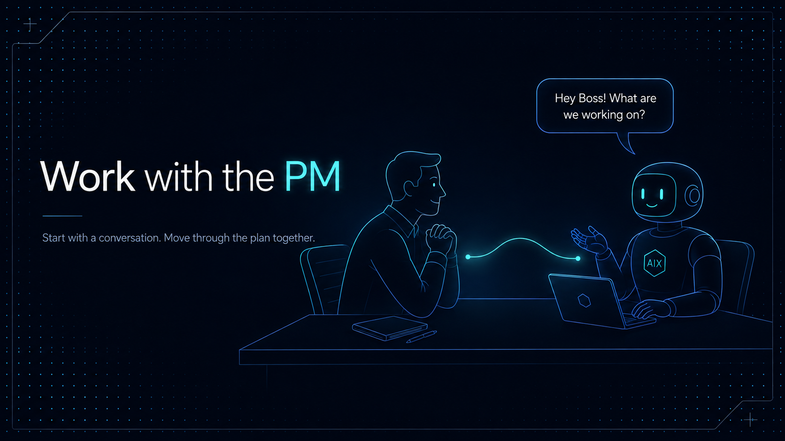

# Work with the AIX PM



This guide shows developers how to work with the project-manager role in a
project with an active AIX workflow. The PM is an agent role, not a replacement
for the human decision principal.

## Start with the workflow

Install AIX and the default workflow:

```bash
npm install -g @tekfoundry/aix
aix init
aix workflow install
```

The workflow installs the PM role, registers its specialist team in `team.md`,
and adds the workflow instructions that tell agents how to route work.

## Give the PM a request

In a conversation with an agent that has the active PM role, give the PM the
outcome you want:

```text
Add support for exporting the project status as JSON. Review the design first,
keep the CLI output backward compatible, and include verification.
```

The PM reads the registered team, selects the smallest adequate role sequence,
and delegates bounded assignments. Depending on the request, it may involve a
Product Owner, Requirements Engineer, Technical Architect, Implementation
Engineer, Quality Engineer, Security Engineer, Documentation Specialist, or
Release Engineer.

You can refer to the active PM as `pm`, `project manager`, `manager`, or
`project-manager`, without regard to casing. In direct conversation, the PM
addresses the human decision principal as Boss.

## What happens next

The PM's normal cycle is:

```text
request → classify → select team → delegate bounded work
        → collect results → verify and reconcile → report to Boss
```

Each assignment includes a role, task mode, delivery mode, allowed paths,
denied paths, stop conditions, and expected evidence. Specialists can work in
parallel when their dependencies, write domains, and shared artifacts allow it.
The PM coordinates their results and keeps final decisions with Boss.

The PM may pause or hand work back when requirements are unclear, a role lacks
the required authority, a host capability is unavailable, a worker needs a
decision, or a safety boundary would be crossed.

## Follow the Design-Plan-Execute loop

For feature work, the PM follows a staged conversation. Each step produces the
context needed for the next one, and Boss decides when the work should advance.

1. Create and refine the plan:

   ```text
   Let's work together on creating a new plan for a feature. I have a
   high-level vision for the feature. Please help me flesh out the design and
   direction for this plan.
   ```

2. Activate the approved plan:

   ```text
   Please activate the plan.
   ```

3. Execute the next phase:

   ```text
   Please complete the next phase in the plan.
   ```

4. Complete the plan:

   ```text
   Please complete the final plan checklist.
   ```

The PM can recommend the next step, but plan activation, priority changes,
risky approvals, final acceptance, and release decisions remain with Boss.

## Ask for a dry run with PM Review

Prefix a request with `PM Review` to see how the PM would classify and route it
without delegating work or changing files:

```text
PM Review: update the authentication flow and add regression tests.
```

The review reports the proposed roles, activities, task context, sequencing
notes, and guidance plan, then stops before delegation, commands, edits,
verification, or lifecycle changes.

## Inspect PM activity

The `aix pm` command family inspects runtime state. It does not start a
conversation with the PM:

```bash
aix pm status
aix pm status --verbose
aix pm doctor
```

Use `status` for sessions, leases, delegations, and scheduler states. Use
`doctor` for host capability checks. See [PM runtime](pm-runtime.md) for the
technical record layout, scheduling rules, and cleanup behavior.

## Keep authority clear

Boss retains authority for product priorities, risky approvals, exceptions,
final acceptance, and release decisions. The PM and specialist roles prepare
work and evidence for those decisions. They do not silently broaden scope or
replace human approval gates.
