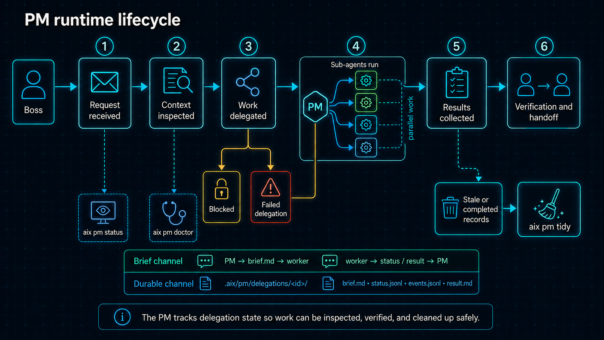

# PM runtime



This document describes the technical runtime behind AIX's project-manager
workflow. It is intended for workflow authors, host integrators, and developers
who need to inspect or troubleshoot delegation behavior.

## Runtime state

The PM stores project-local runtime state under `.aix/pm/`:

```text
.aix/pm/
  session.json
  lease.json
  completion.json
  delegations/
    index.json
    <delegation-id>/
      brief.md
      status.jsonl
      result.md
      events.jsonl
      record.json
      workspace.json
  decisions/
  diagnostics/
  workspaces/
  locks/
```

Delegation records preserve the request contract, selected role, task and
delivery modes, allowed and denied paths, lifecycle state, scheduling decision,
worker identity, and returned result. Events provide an append-only timeline for
dispatch, progress, blocking decisions, completion, and recovery.

Runtime state is project-local and must remain inside the canonical `.aix/pm/`
directory. PM path checks reject unsafe path segments, symlink escapes, and
parent-context writes to project artifacts.

## Brief and durable communication

PM work uses two communication paths. The brief channel carries the bounded
assignment and live exchange: the PM sends `brief.md` to the worker, and the
worker returns status updates and a result. The durable channel records that
exchange under `.aix/pm/delegations/<delegation-id>/`, including the brief,
status history, events, result, and delegation record.

The brief keeps the worker focused. The durable files let the PM inspect,
correlate, and recover work after a host interruption or a resumed session.

## Delegation lifecycle

Delegations can move through these states:

| State | Meaning |
| --- | --- |
| `created` | The PM created the delegation contract. |
| `queued` | The task is waiting for a dependency, scope, or capacity condition. |
| `serialized` | The task is waiting behind a declared serialization policy. |
| `dispatched` | A host worker has received the bounded assignment. |
| `working` | The worker is processing the assignment. |
| `needs-decision` | The worker needs a parent or human decision. |
| `blocked` | Work cannot continue until a blocking condition changes. |
| `paused` | The PM has paused the delegation. |
| `completed` | The worker returned a completed result. |
| `failed` | The delegation failed. |
| `cancelled` | The delegation was cancelled. |
| `expired` | The delegation exceeded its usable lifetime. |
| `superseded` | A newer delegation replaced it. |
| `host-lost` | The host worker disappeared before the PM received a final result. |
| `unknown` | The runtime cannot determine a more specific state. |

## Scheduling and parallel work

The PM can admit independent assignments in parallel, but it does not treat
parallelism as permission to let workers collide. Scheduler decisions consider:

- Explicit task dependencies
- Declared write domains
- Shared artifacts
- Role serialization policies
- Host capacity and required capabilities

Tasks with unmet dependencies remain queued. Tasks with overlapping write
domains or shared artifacts are grouped or serialized according to the team
contract. A change-producing task must declare a write domain. The scheduler
records its decision and rationale in the delegation events.

Roles declare the allowed task modes (`scout`, `implementation`, `review`, or
`verification`) and delivery modes (`report-only`, `local-change`, or
`isolated-change`). The PM rejects assignments that exceed those declarations.

## Host capabilities

Workflows can require capabilities such as:

- `native-worker-creation`, for creating bounded host-native workers
- `correlated-results`, for matching worker results to delegation records

`aix pm doctor` checks the host authorization report before PM work begins.
`aix pm status --verbose` includes scheduler and host diagnostic details. If a
required capability is unavailable or unknown, PM-routed work should stop
instead of running specialist work in the parent context.

```bash
aix pm doctor
aix pm doctor --verbose
aix pm status
aix pm status --verbose
```

## Inspect and clean runtime data

`aix pm tidy` previews cleanup by default. Its default retention window is 30
days, but active, blocked, unlanded, referenced, or otherwise unresolved data
is held. Completed data requires an explicit selection with `--completed`.

```bash
aix pm tidy
aix pm tidy --older-than 60
aix pm tidy --completed --older-than 60
```

Use `--archive` for reversible housekeeping that retains live data, `--apply`
for the same archive operation, or `--purge` for permanent removal of eligible
delegation data and diagnostic logs:

```bash
aix pm tidy --archive
aix pm tidy --apply
aix pm tidy --purge
```

Interactive terminals ask for confirmation before mutation. Non-interactive
automation should treat these options as explicit authorization and capture
the preview output before applying cleanup.

Cleanup also checks for plan references, unmerged worktrees, unresolved
integrations, destructive-risk holds, and completion authorization. A plan's
completion promotion or an explicit cleanup waiver can authorize eligible
records for cleanup.

## Workflow removal and PM data

Workflow uninstall checks for active or unlanded PM delegation datasets. Without
explicit confirmation, it refuses to remove the workflow:

```bash
aix workflow uninstall
aix workflow uninstall --confirm-pm-data
```

The confirmation authorizes deletion of only the active or unlanded PM datasets
associated with that workflow. It does not authorize removal of unrelated PM
runtime data, project documentation, or standalone assets.

`--reconcile-protected` is a separate update option. Use it only after
reviewing why a protected workflow-managed file or role needs replacement:

```bash
aix workflow update --reconcile-protected
aix role update <active-name|source/path> --reconcile-protected
aix roles update [active-name|source/path] --reconcile-protected
```

The option allows the selected update to reconcile protected managed state. It
does not bypass normal package validation or remove project-owned files.
