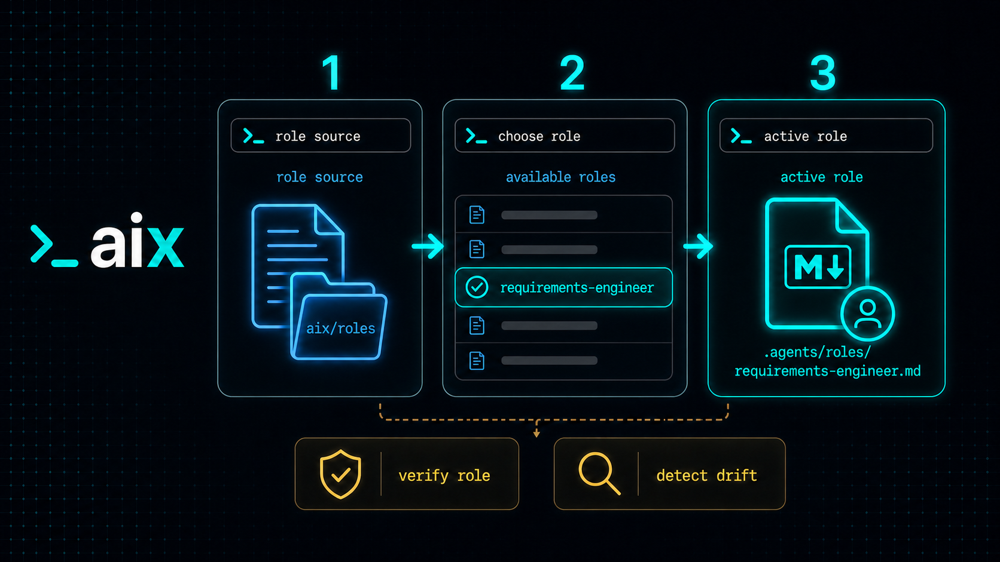

# Author roles for AIX



A role gives an agent a focused responsibility or point of view for work that
needs judgment. A skill tells an agent how to repeat a task. A role tells the
agent what kind of expert to be while choosing, applying, or reviewing those
tasks.

## Role structure

A role is a directory bundle with a `ROLE.md` contract and, usually, a
`GUIDANCE.md` file:

```text
roles/
  quality-engineer/
    ROLE.md
    GUIDANCE.md
```

`ROLE.md` should define when to use the role, its responsibility and scope, the
context it should inspect, skills it may consider, stop conditions, and the
output it should return. `GUIDANCE.md` provides reusable working rules and
judgment for the role.

Together, these documents give a sub-agent clear boundaries. They describe
what it should do, what it can change or deliver, and when it should return
work to the PM. A workflow's `team.md` registers the roles that the PM can
select for delegation.

Example `ROLE.md`:

```md
---
name: quality-engineer
description: Reviews test strategy, regression risk, and verification evidence.
tools: Read, Glob, Grep, Bash
model: inherit
color: green
---

# Purpose

Review whether a change has enough verification for its risk and scope.

# When To Use

Use this role before completing risky implementation work or when test coverage
is unclear.

# Context To Inspect

Read the active plan or work item, changed source files, changed tests,
existing test patterns, and the latest verification output.

# Skills To Consider

If the host project has verification or review skills active, consider using
them for targeted checks.

# Stop Conditions

Stop if expected behavior is unclear, verification cannot run, or safety-
sensitive behavior lacks an explicit test or review path.

# Expected Output

Return concrete test gaps, suggested checks, residual risk, and the exact
verification evidence reviewed.
```

Example `GUIDANCE.md`:

```md
---
uses_guidance:
  - activities/verification
  - activities/review
---

# Quality engineer guidance

## Job focus

Decide what evidence is needed before a change can be trusted. Connect
implementation risk to targeted verification, not just test volume.

## How to work

- Start with the behavior, lifecycle contract, or safety guarantee the change
  must preserve.
- Read the active plan, changed files, nearby tests, and verification strategy.
- Map checks to risk, including success paths, failure paths, edge cases, and
  rollback-sensitive behavior.
- Prefer deterministic targeted tests before broad test suites.
- Make manual validation explicit when automation cannot see the behavior.

## Output discipline

- Lead with blockers, failed checks, and untested high-risk paths.
- List exact commands and results.
- Separate required verification from optional confidence-building checks.
```

The bundled
[`design-plan-execute` roles](../aix/workflows/design-plan-execute/roles/project-dev/)
directory provides complete examples of roles and their guidance, including
product, architecture, implementation, quality, security, documentation, and
release responsibilities.

## Bundled AIX roles

AIX also includes roles for maintaining the AIX asset and workflow system.
These are standalone roles, not roles owned by a particular workflow:

| Role | What it does |
| --- | --- |
| [`aix-workflow-architect`](../aix/roles/aix-dev/aix-workflow-architect/ROLE.md) | Designs and reviews workflow packages, including their skills, templates, managed `AGENTS.md` blocks, and lifecycle boundaries. |
| [`aix-skill-author`](../aix/roles/aix-dev/aix-skill-author/ROLE.md) | Authors and reviews skills for clear triggers, repeatable steps, supporting resources, and safe reuse. |
| [`aix-package-safety-reviewer`](../aix/roles/aix-dev/aix-package-safety-reviewer/ROLE.md) | Reviews package resolution, activation, lockfiles, drift detection, collisions, and removal behavior. |
| [`aix-agent-instructions-auditor`](../aix/roles/aix-dev/aix-agent-instructions-auditor/ROLE.md) | Reviews agent instruction files for drift, stale paths, ownership conflicts, and unsupported host behavior. |
| [`aix-release-readiness-specialist`](../aix/roles/aix-dev/aix-release-readiness-specialist/ROLE.md) | Reviews package contents, generated artifacts, release checks, and public installation readiness. |

## Standalone and workflow-owned roles

Roles can be standalone project assets or part of a workflow. Put a role inside
a workflow when it depends on that workflow's skills, guidance, templates, or
process. Keep it standalone when it can serve projects independently.

Workflow-owned roles follow the workflow lifecycle. Standalone roles are
managed separately and become active under `.agents/roles/<name>/ROLE.md`.
Active role guidance remains project-editable after activation.

## Manage standalone roles

Add a Git-backed role source and inspect the roles it exposes:

```bash
aix roles add <git-or-github-tree-url> [alias]
aix roles list [source]
```

Activate one role, optionally giving it a local alias:

```bash
aix role activate <source>/<role-path> [alias]
```

Review, update, reset guidance, or deactivate an active role:

```bash
aix role diff <active-name|source/path>
aix role update <active-name|source/path>
aix role guidance reset <active-name>
aix role deactivate <active-name>
```

`aix roles add` discovers role files and records source metadata without
activating them. `aix role activate` materializes one role under `.agents/`
and records the root role intent in `aix.json`. Diff, update, and deactivate
check for local drift before changing or removing files.

Delegation is explicit and bounded. Ask for a named role, such as `Use
quality-engineer to plan verification`. The PM or delegation skill resolves
that role and keeps the parent session responsible for plan state, safety,
verification review, final decisions, and reporting.

Role-owned skills belong to the role's lifecycle. If a role package provides
its own skills, deactivate or update the role instead of removing those skills
directly.

## Host compatibility

`.agents/roles/` is AIX's canonical role storage. Host-specific directories
such as `.claude/agents` or `.codex/agents` are compatibility outputs only and
are not written unless an explicit integration owns that behavior.
