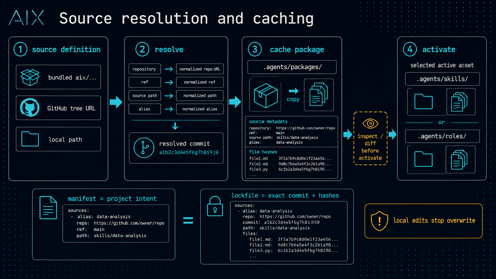

# Manage AIX sources



This technical guide explains how AIX resolves, caches, and tracks Git-backed
and local sources for skills, roles, and workflows.

## Source types

AIX supports sources that point to a local bundled path or a Git repository
tree. GitHub tree URLs are accepted as a convenient form of Git source:

```bash
aix skills add https://github.com/example/skills/tree/main/skills team-skills
aix roles add https://github.com/example/roles/tree/main/roles team-roles
aix workflow install https://github.com/example/ai-assets/tree/main/workflows/team-flow team-flow
```

Bundled assets can be addressed by their local package paths:

```bash
aix workflow install aix/workflows/design-plan-execute
aix skill activate aix/discover-skill
```

AIX records the source URL or bundled source, repository ref, source-relative
path, and optional alias in project state. Registry, marketplace, service
account, and global-install behavior are outside the current model.

## Source, package, and active layers

An installed asset has three useful layers:

```text
source definition
      ↓ resolve and cache
package copy under .agents/packages/
      ↓ activate
active file or link under .agents/skills/ or .agents/roles/
```

The source definition tells AIX where to look. The package copy preserves the
resolved asset and its source metadata. The active path is what the agent
environment reads. The manifest records project intent, while the lockfile
records the exact resolved package and file hashes.

Keeping these layers separate lets a project inspect a source without
activating everything it contains, use an alias without changing the upstream
name, and detect changes before they reach the active environment.

## Add and inspect sources

The plural command families manage source collections and their discoverable
assets:

```bash
aix skills add <git-or-github-tree-url> [alias]
aix skills list <source> [--missing-only]
aix roles add <git-or-github-tree-url> [alias]
aix roles list <source> [--missing-only]
```

Source addition indexes the available skills or roles but does not activate
them. Listing uses that cached discovery metadata and reports source-relative
paths with copyable activation commands. `--missing-only` filters out assets
already represented in the local lockfile.

Workflow installation resolves one workflow package and validates its manifest,
docs, guidance, templates, roles, skills, team contract, and managed
`AGENTS.md` content before writing project state.

## Refs, paths, and aliases

A GitHub tree URL carries a repository, ref, and path. AIX normalizes that
information into a source definition so later list, diff, update, and lockfile
operations use the same target. A source can point at a branch or another Git
ref, but the lockfile records the resolved commit used by the project.

Use an alias when two sources expose the same active name:

```bash
aix skill activate team-skills/review team-review
aix role activate team-roles/quality-engineer qe
```

The alias changes the project-local active name. It does not rename the
upstream package or alter the source copy. AIX refuses ambiguous source targets,
unsafe paths, and active-name collisions.

## Update and remove sources

Inspect changes before accepting a new resolved version:

```bash
aix skills diff
aix skills update
aix roles diff
aix roles update
aix workflow diff
aix workflow update
```

Remove a source only after its active assets have been deactivated:

```bash
aix skill deactivate team-review
aix skills remove team-skills
aix role deactivate qe
aix roles remove team-roles
```

Workflow-owned assets are managed by the workflow lifecycle and cannot be
removed through standalone commands.

## Trust and local safety

Review the source and the proposed diff before activation or update. AIX keeps
source metadata and resolved commits in the lockfile so changes are visible in
version control. It checks package and active file hashes before updating,
deactivating, or removing managed content and stops when local edits would be
overwritten.

Source resolution does not make an external repository trusted by itself. The
project chooses which sources to add and which assets to activate. Treat new
source content as code review material, especially when it can change agent
instructions or workflow behavior.
