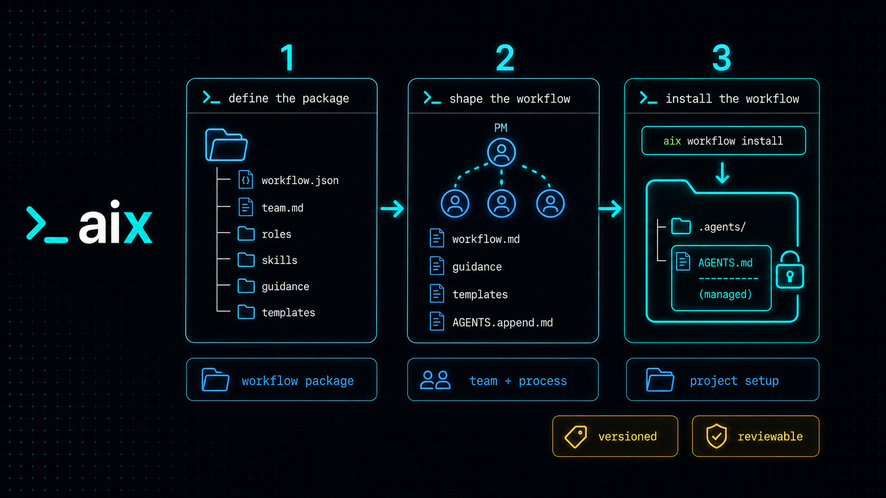

# Customize an AIX workflow



A custom workflow lets a team define how AI-assisted work should move from a
request to a finished result. You choose the process, the team, the skills,
the guidance, the templates, and the project instructions that belong together.
AIX packages those choices so the workflow can be installed, reviewed, updated,
and shared like any other project dependency.

## Start with a workflow package

A custom workflow is a Git-backed directory with a `workflow.json` manifest:

```text
workflows/team-flow/
  workflow.json
  AGENTS.append.md
  README.md
  workflow.md
  team.md
  roles/
    product-owner/
      ROLE.md
      GUIDANCE.md
  guidance/
    shared.md
    activities/
      planning.md
  skills/
    project-init/
      SKILL.md
    task-execute/
      SKILL.md
  templates/
    plan.md
```

The package can contain:

- Process documentation in `workflow.md` and other files listed in the
  manifest.
- A `team.md` roster that tells the PM which sub-agents are available.
- Roles that define focused responsibilities and points of view.
- Skills that describe repeatable procedures.
- Guidance that supplies working rules for roles, skills, and activities.
- Templates for plans, designs, work items, and other agent-created artifacts.
- An `AGENTS.append.md` file for workflow instructions managed in the project
  root.

## Add workflow instructions to `AGENTS.md`

`AGENTS.append.md` is the workflow's contribution to the project's root
`AGENTS.md`. It should contain only the instructions that the workflow owns,
such as where agents should look for workflow documentation and what process
contract they should follow.

When the manifest uses the `managed-block` mode, `aix workflow install`:

1. Reads the workflow's `AGENTS.append.md` file.
2. Creates `AGENTS.md` if the project does not have one.
3. Inserts the content inside a marked block, such as:

   ```md
   <!-- aix:workflow team-flow start -->
   ...workflow instructions...
   <!-- aix:workflow team-flow end -->
   ```

4. Records the block and its hashes in `aix.lock.json`.

The markers let AIX update or remove the workflow's instructions without
rewriting the rest of `AGENTS.md`. Project-owned instructions outside the
marked block stay in place, as do blocks managed by other AIX packages.

On `aix workflow update`, AIX replaces only the matching managed block after
checking that it still matches the installed version. If someone edited the
block, or if an unmanaged block with the same marker already exists, AIX stops
instead of overwriting it. On `aix workflow uninstall`, AIX removes only the
workflow-owned block and leaves the rest of `AGENTS.md` alone.

## Define the team

The workflow's `team.md` file is the PM's delegation roster. It describes each
sub-agent's responsibility, operating boundaries, capabilities, and expected
evidence. The PM uses that information to match a request to the right
specialist. Several specialists can work in parallel when a request crosses
multiple areas.

Each sub-agent should have a `ROLE.md` and a `GUIDANCE.md` document:

- `ROLE.md` defines the sub-agent's responsibility, perspective, scope, and
  expected modes of work.
- `GUIDANCE.md` gives it the working rules and judgment to apply while it
  performs or reviews work.

Together, these documents set the boundaries for what a sub-agent should do,
what it can change or deliver, and when it must return work to the PM. This is
where a workflow turns a collection of agents into a defined project team.

The PM role is the workflow's coordination point. Boss gives the PM the request.
The PM reads the roster, selects the appropriate sub-agents, delegates bounded
work, and coordinates their results, verification, and handoff.

### Team roster contract

Each roster entry can declare more than a name and description. The PM uses the
contract to decide whether an assignment is allowed and how it can run:

- `taskModes` limits the role to work such as `scout`, `implementation`,
  `review`, or `verification`.
- `deliveryModes` limits whether it may return a report, make a local change,
  or work in an isolated change workspace.
- `writeDomains` and `deniedAreas` define the paths it may and may not change.
- `requiredEvidence` defines what the role must return with its result.
- `sharedArtifacts` and `serialization` tell the scheduler when work must be
  coordinated instead of run independently.
- `requiredCapabilities` identifies host features needed by the role or
  workflow, such as native worker creation or correlated results.

The workflow validates these fields when it is installed. A role cannot be
assigned a task mode, delivery mode, or path outside its declared contract.
Keep the roster narrow and explicit. It is both the PM's team directory and
the boundary that protects project files during delegation.

## Configure the manifest

The manifest names the workflow, its documentation, managed `AGENTS.md`
integration, asset directories, PM dependency, team roster, and required host
capabilities.

```json
{
  "name": "team-flow",
  "title": "Team Flow",
  "agentsMd": {
    "mode": "managed-block",
    "source": "AGENTS.append.md",
    "marker": "aix:workflow team-flow"
  },
  "docs": [
    "README.md",
    "workflow.md"
  ],
  "guidanceDir": "guidance",
  "templatesDir": "templates",
  "skillsDir": "skills",
  "dependencies": {
    "roles": [
      {
        "source": "aix",
        "path": "roles/project-manager",
        "activeName": "project-manager"
      }
    ]
  },
  "team": {
    "path": "team.md",
    "version": "1"
  }
}
```

Keep these rules in mind:

- `name` must match the workflow directory name.
- Files in `docs` are copied into the project's `.agents/` directory.
- `AGENTS.append.md` is inserted into the root `AGENTS.md` inside a managed
  block.
- Skills under `skills/` become workflow-owned skills.
- Workflow-owned roles and skills follow the workflow's lifecycle.
- Guidance under `guidance/` remains package-owned until the project publishes
  editable overrides.
- The workflow declares the host capabilities it needs, such as native worker
  creation or correlated results.

The bundled
[`design-plan-execute` workflow](../aix/workflows/design-plan-execute/) is a
complete example with a PM, a registered development team, lifecycle skills,
guidance, templates, and managed project instructions.

## Install and maintain a custom workflow

Install a workflow from a GitHub tree URL:

```bash
aix workflow install https://github.com/example/ai-assets/tree/main/workflows/team-flow team-flow
```

With no URL, `aix workflow install` lists bundled workflows. A project can have
one active workflow at a time.

Inspect or update the active workflow with:

```bash
aix workflow diff
aix workflow update
aix workflow uninstall
```

`aix workflow diff` compares the locked workflow package with its resolved
source. `aix workflow update` refreshes the installed files and lockfile after
drift checks pass. `aix workflow uninstall` removes package-managed workflow
content while leaving project-owned documentation and text outside the managed
`AGENTS.md` block alone.

## Author the building blocks

Roles and skills can be developed independently and then included in a
workflow. Use a role when the agent needs a defined responsibility or point of
view. Use a skill when it needs a repeatable procedure.

- [Author roles for AIX](role-authoring.md) covers `ROLE.md`, `GUIDANCE.md`,
  delegation boundaries, and standalone role management.
- [Author skills for AIX](skill-authoring.md) covers `SKILL.md`, triggers,
  repeatable procedures, and standalone skill management.
- [Author workflow templates](template-authoring.md) covers document templates,
  reusable sections, placeholders, validation, and project overrides.
- [Author guidance](guidance-authoring.md) covers role and workflow activity
  guidance, metadata, companion files, and project overrides.
- [Manage AIX sources](source-management.md) covers source resolution, caching,
  aliases, refs, and trust boundaries.

Workflow-owned roles and skills follow the workflow lifecycle. AIX checks for
local drift before changing or removing managed files, so customization stays
visible instead of being silently overwritten.
