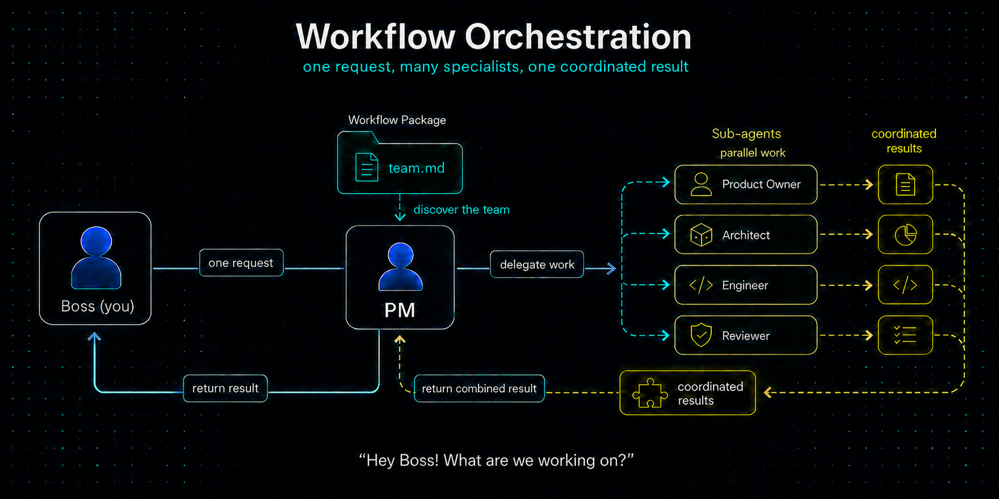
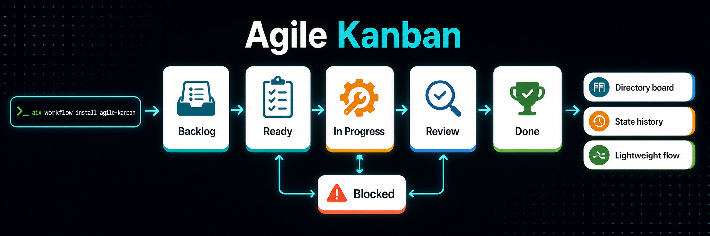

# Workflow orchestration



An AIX workflow is an installable operating model for agent-assisted work. It
groups process documentation, skills, roles, guidance, templates, and project
instructions so they move together as one package.

## The PM model

A workflow can register a team with AIX's project-manager role. The PM is the
coordination point for meaningful project work. Boss, the human decision
principal, gives the PM the request. The PM chooses the right team members and
delegates bounded work to them as sub-agents. The PM brings their results and
evidence back together for Boss.

### Discovering the team

The workflow's `team.md` file registers the sub-agents available to the PM. It
describes each member's responsibility so the PM can match a request to the
role(s) best suited to handle it. A request may go to one sub-agent or to
several sub-agents working in parallel when the work benefits from different
specialties.

### Tailoring each sub-agent

Every sub-agent has two documents that shape how it works:

- `ROLE.md` defines the sub-agent's responsibility, perspective, and scope.
- `GUIDANCE.md` provides the working rules and judgment it should apply when
  producing or reviewing work.

Together, these documents give each specialist clear boundaries. They guide
what the sub-agent should do, what it can change or deliver, and when it should
hand work back to the PM. The PM uses those defined boundaries to coordinate
parallel contributions into one result.

```text
Boss gives the PM a request
        ↓
PM selects the registered team
        ↓
Sub-agents handle bounded responsibilities
        ↓
PM coordinates results, verification, and handoff
```

The PM does not replace you (a.k.a. the Boss). Boss retains authority
for priorities, risky approvals, exceptions, final acceptance, and release
decisions.

Workflows choose their own process by defining tailored roles. The default
`design-plan-execute` workflow uses the PM role and defines this specialist
team:

- Product Owner
- Requirements Engineer
- Technical Architect
- Product Designer
- UX Writer
- Implementation Engineer
- Quality Engineer
- Security Engineer
- Documentation Specialist
- Release Engineer

The PM may involve several roles in parallel when the work calls for it. A
different workflow can define another team and lifecycle while using the same
AIX package model.

## Install a workflow

Initialize the project first:

```bash
aix init
```

Then install the bundled default workflow:

```bash
aix workflow install
```

You can also install a workflow from a local path or GitHub tree URL:

```bash
aix workflow install aix/workflows/design-plan-execute
aix workflow install https://github.com/example/ai-assets/tree/main/workflows/team-flow team-flow
```

A project can have one active workflow at a time. A workflow install stages and
validates the package, writes its docs into `.agents/`, updates the managed
`AGENTS.md` block, activates workflow-owned skills and roles, and records the
result in `aix.json` and `aix.lock.json`.

Check or update the active workflow with:

```bash
aix workflow diff
aix workflow update
aix workflow uninstall
```

`aix workflow uninstall` removes package-managed workflow content. It leaves
project-owned `_docs` content and text outside the managed `AGENTS.md` block
alone.

## Bundled workflows

### Design-plan-execute


[`design-plan-execute`](../aix/workflows/design-plan-execute/README.md) is the
default workflow for coding agents. It keeps work grounded in project
knowledge, small plans, verified changes, and documentation that stays current
with the code.

It includes a PM role, a registered development team, lifecycle skills,
activity guidance, templates, and managed project instructions. Read the
[`design-plan-execute` README](../aix/workflows/design-plan-execute/README.md)
for the installed roles, skills, files, and team contract.

### Agile Kanban



[`agile-kanban`](../aix/workflows/agile-kanban/README.md) is a lightweight
Kanban workflow. It uses Markdown work items organized by state directories for
Backlog, Ready, In Progress, Review, Blocked, and Done. It does not require
Jira, Trello, GitHub Projects, Linear, or another external service.

Read the [`agile-kanban` README](../aix/workflows/agile-kanban/README.md) for
its skills, templates, and installed layout.

## Customize a workflow

Create a custom workflow when your team needs its own process, team roster,
roles, skills, guidance, templates, or project instructions. See
[Author a custom workflow](workflow-authoring.md) for the package layout,
manifest, team definition, role boundaries, and maintenance commands.

## PM runtime checks

The PM runtime has commands for inspection, host capability checks, and cleanup:

```bash
aix pm status
aix pm doctor
aix pm tidy
```

`aix pm tidy` previews cleanup by default. Use its explicit mutation options
only when you intend to archive, apply housekeeping, or purge eligible PM
runtime data.
